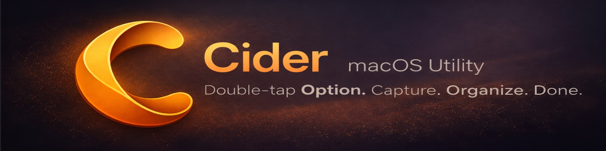

  

  <a href="https://github.com/TheVisher/Cider/releases/latest">Download Beta</a>
  &nbsp;&bull;&nbsp;
  <a href="https://github.com/TheVisher/Cider/issues">Send Feedback</a>

---

  

---

## What is Cider?

Cider is a lightweight macOS app that floats above everything. Double-tap the Option key and it appears on whatever screen your mouse is on. Capture bookmarks, write notes, track events, and organize it all with folders and tags, without ever leaving what you're doing.

At its core, Cider is a personal knowledge base and AI 2nd Brain for macOS. It gives you one place to collect what matters, keep context close, and build a system you can actually use every day instead of another app that turns into a pile of saved links.

The AI layer is optional. You can use Cider as a fast native capture and organization tool with no AI workflow at all, or connect the intelligence layer that fits you best, whether that's cloud LLMs, native Apple/macOS AI capabilities, or local models running on your own machine.

No Electron. No subscriptions. Just a native Swift app that stays out of your way until you need it.

## Features

**Capture anything**
- Press Opt+B to save the current browser tab with a thumbnail
- Copy any URL. Cider catches it from your clipboard and offers to save it
- Drag images onto bookmarks or directly into notes
- Screen capture with OCR routing

**Write notes**
- Press Opt+N to start a note from anywhere
- Rich text editor with markdown, images, code blocks, and tables
- Copy text from any app and paste it right in

**Build a 2nd Brain, optionally**
- Use Cider as a plain personal knowledge base with no AI dependency
- Add AI only when it helps with recall, synthesis, or organization
- Choose the model/provider setup that fits your workflow: hosted LLMs, native macOS AI, or local models

**Organize your way**
- Folders with nesting and drag-and-drop
- Tags for flexible cross-cutting categories
- Custom tabs that save your filters, sort, and layout
- List, grid, and masonry layouts with a continuous card size slider

**Track dates and contacts**
- Create date cards for events, deadlines, and reminders
- Upcoming events surface automatically in your feed
- Store contacts with birthdays and notes

**Find everything**
- Cmd+K search palette across all your content
- Token-based search. Just start typing
- Sidebar search for filtering the current view

**Built for macOS**
- Native SwiftUI + AppKit. No web views, no wrappers
- Dark acrylic panel with custom shadows
- Respects Reduce Motion and system accessibility settings
- Core Spotlight indexing for system-wide search

## Requirements

- macOS 26.0 or later
- Apple Silicon or Intel Mac

## Install

1. Download the latest `.dmg` from [Releases](https://github.com/TheVisher/Cider/releases/latest)
2. Open the `.dmg` and drag Cider to your Applications folder
3. Launch Cider. Double-tap Option to open the panel

> **First launch:** macOS may ask you to confirm since Cider is distributed outside the App Store. The app is notarized by Apple.

## Keyboard Shortcuts

| Shortcut | Action |
|----------|--------|
| Option + Option | Open / close Cider |
| Opt + B | Capture active browser tab |
| Opt + Shift + B | Capture without opening panel |
| Opt + N | New note |
| Cmd + K | Search palette |
| Cmd + A | Select all visible items |
| Esc | Dismiss panel |

## Feedback

This is an early beta. Things will break and features are still landing. If you run into issues or have ideas, please [open an issue](https://github.com/TheVisher/Cider/issues). It genuinely helps.

## License

Cider is source-available. You're welcome to read the code, learn from it, and file issues. See [LICENSE](LICENSE) for details.
